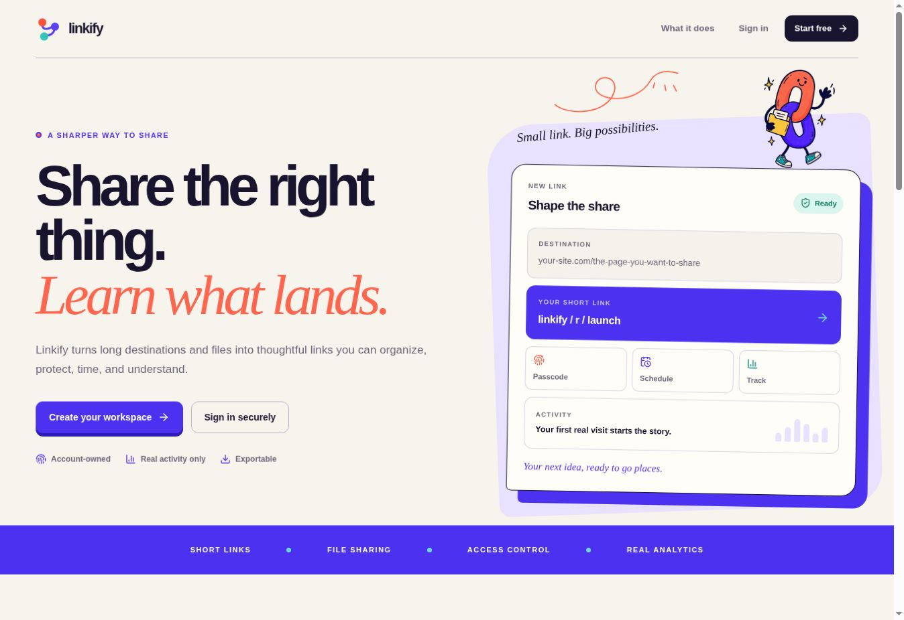
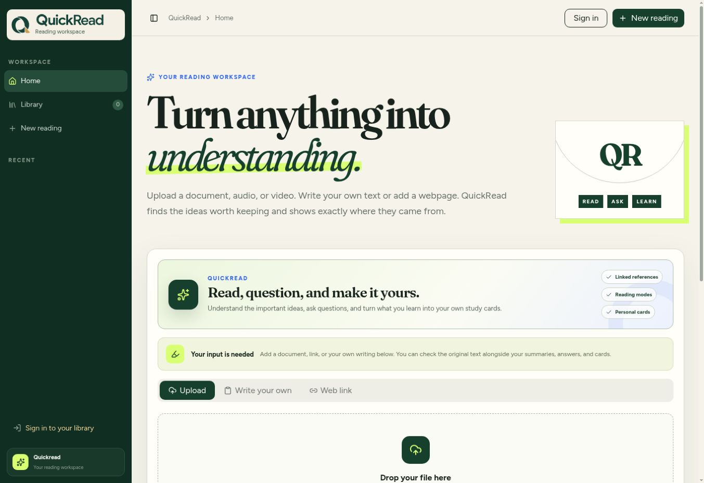
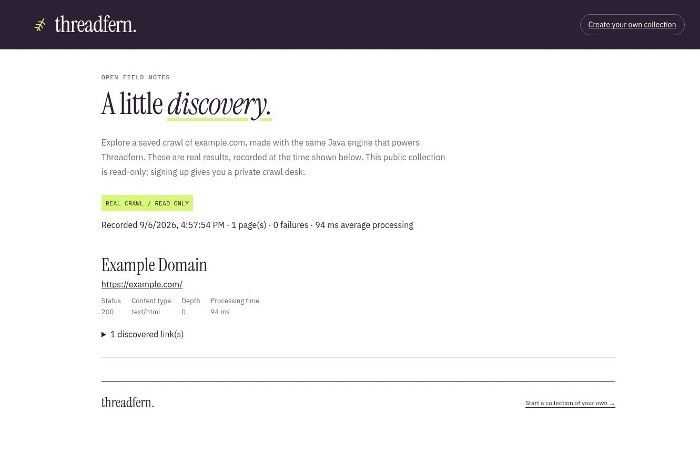
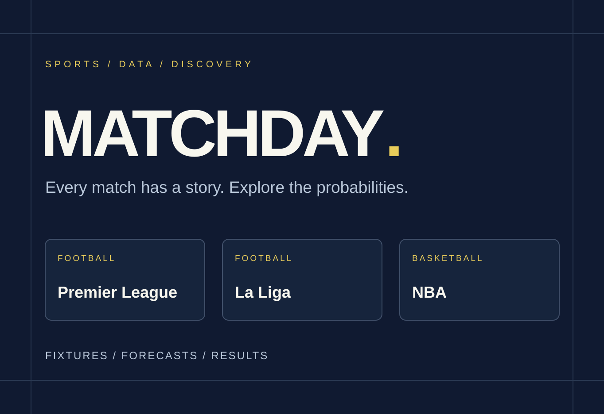
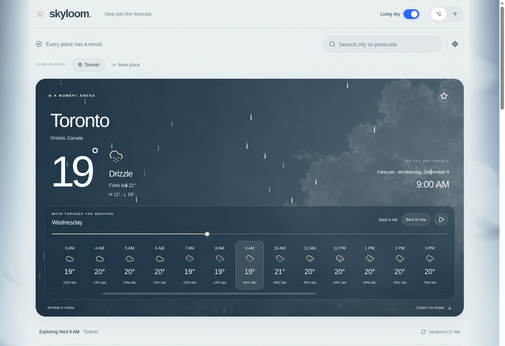
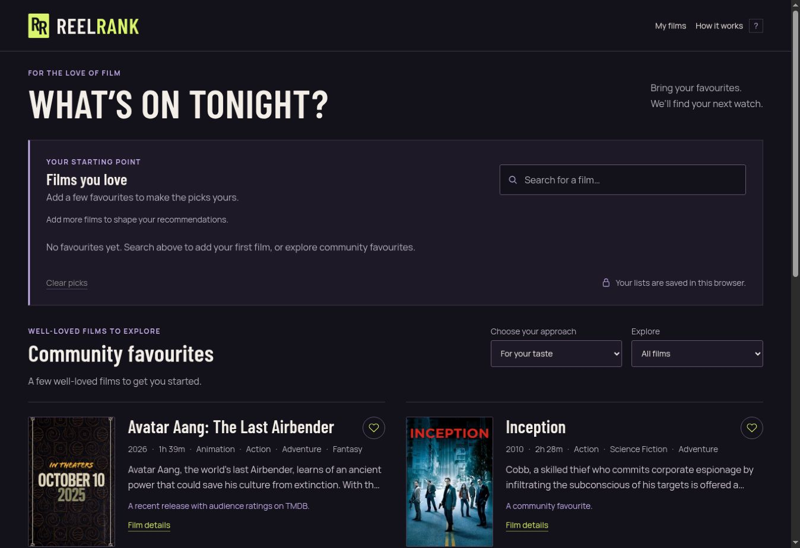

  

  <a href="https://www.linkedin.com/in/gerald-ikem-158926233/"><strong>LinkedIn</strong></a> &nbsp; · &nbsp;
  <a href="mailto:geraldikem18@gmail.com"><strong>Email me</strong></a> &nbsp; · &nbsp;
  <a href="#explore-the-projects"><strong>Explore the projects</strong></a>

**Hi, I'm Gerald Ikem—a backend engineer based in Toronto.** At **Payaza**, I build Java APIs for payments, onboarding, and rate management. I also develop and maintain websites for **Believer's LoveWorld**.

I'm pursuing a **Master of Computer Science at the University of Illinois Urbana-Champaign**, following a Computer Science degree from **York University**. My interests span **backend engineering, data science, and applied machine learning**. These projects bring those interests into apps people can explore and use.

## Explore the projects

<table>
<tr>
<td width="50%" valign="top">

### 01 / Linkify
**One place for everything you share.**

Create memorable short links, share large files, and bring your links together on a personal page. Add custom QR codes, set expiry dates or passcodes, and see how people discover what you've shared.

**Stack:** `Java` `Spring Boot` `PostgreSQL` `Next.js` `TypeScript` `Amazon S3`

**[Visit Linkify](https://uselinkify.com/)**

</td>
<td width="50%" valign="top">

### 02 / QuickRead
**Turn a long read into lasting understanding.**

Bring in documents, webpages, or recordings. Explore summaries at different depths, ask questions with references to the original text, and turn useful ideas into editable study cards and notes.

**Stack:** `Python` `Pyodide` `React` `TypeScript` `Cloudflare Workers`

**[Open QuickRead](https://usequickread.com/)**

</td>
</tr>
<tr>
<td width="50%" valign="top">

### 03 / Threadfern
**Follow the links. Keep the discoveries.**

Crawl a website and collect its page titles, URLs, status codes, and discovered links. Search your collections, inspect broken links, revisit previous runs, and export the results. The public example lets you look around immediately.

**Stack:** `Java 17` `JDBC` `PostgreSQL` `Node.js` `Docker`

**[Explore the demo](https://threadfern.dev/demo)** · [Start a collection](https://threadfern.dev/)

</td>
<td width="50%" valign="top">

### 04 / Matchday ML
**See the game through the numbers.**

Explore Premier League, La Liga, and NBA match predictions. Follow teams, check upcoming fixtures and live results, and compare the probabilities recorded before a game with what actually happened.

**Stack:** `Python` `scikit-learn` `Next.js` `TypeScript` `SQLite`

**[Matchday ML website](https://matchdayml.com/)**

</td>
</tr>
<tr>
<td width="50%" valign="top">

### 05 / Skyloom
**Step into the forecast.**

Explore the weather with a sky that changes alongside the forecast. Move through hourly conditions, check the days ahead, inspect rain and wind charts, follow daylight and moon phases, and save places you care about.

**Stack:** `React` `TypeScript` `Three.js` `React Three Fiber` `Cloudflare Workers`

**[Explore Skyloom](https://skyloom.app/)**

</td>
<td width="50%" valign="top">

### 06 / ReelRank
**Your next film starts with your favorites.**

Discover films shaped by what you like. Compare recommendation approaches, explore film details, build a watchlist, and hide titles you've watched or aren't interested in. Recommendations change as your preferences do.

**Stack:** `Python` `scikit-learn` `pandas` `NumPy` `SciPy` `JavaScript`

**[Find your next film](https://www.reelrank.dev/)**

</td>
</tr>
</table>

---

  <strong>Found something interesting? I'd love to hear what you think.</strong> 
  <a href="mailto:geraldikem18@gmail.com">geraldikem18@gmail.com</a> &nbsp; · &nbsp;
  <a href="https://www.linkedin.com/in/gerald-ikem-158926233/">Connect on LinkedIn</a>

